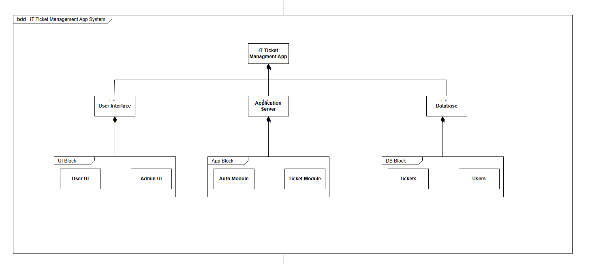
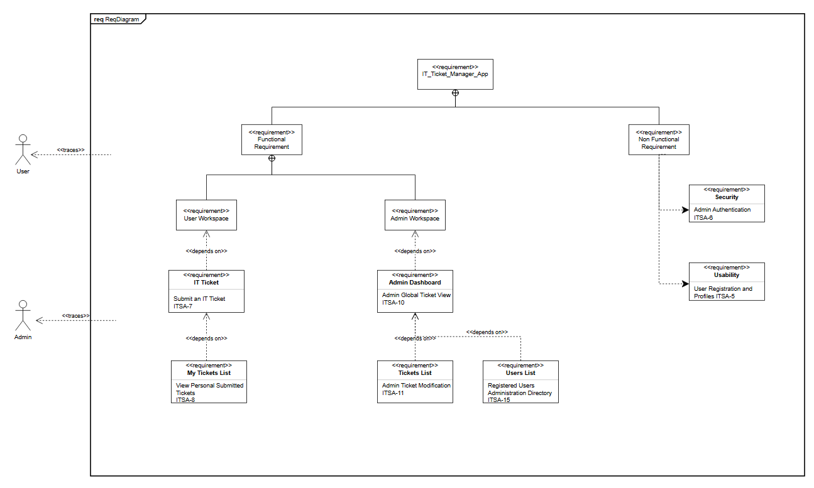
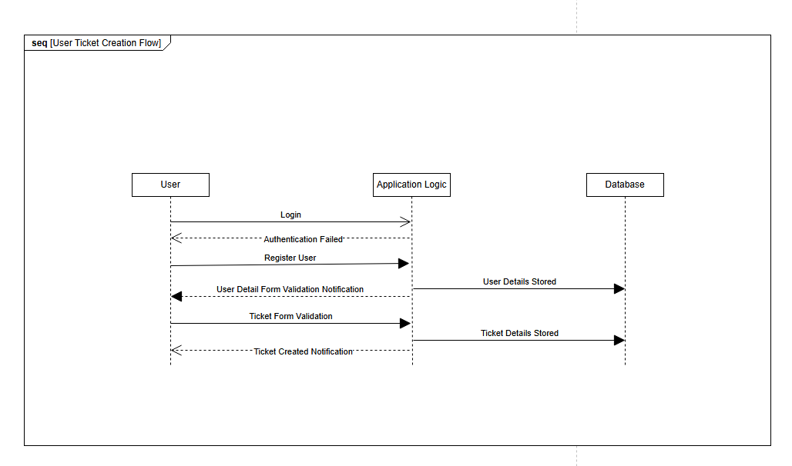

## IT Tech Support App## 

1. What This App Does

This app is a simple tool for employees to report tech issues and for admins to handle them without any hassle.

## For Users

* Drop a Ticket: Log any tech issue easily by adding a Title, Description, and the Incident Date.
* Track Your Issues: Check out the "My Tickets" section to see everything you’ve submitted.
* Quick Edits: Fix a typo or delete a ticket right from your dashboard if you don't need it anymore.

## For Admins

* The Big Picture: View every single ticket submitted across the company under "Manage Tickets."
* Admin Controls: Update ticket info on the fly using a handy slide-out menu, or delete things that don't belong.
* Safety First: A popup confirmation makes sure you don't delete a ticket by accident.
* Manage the Team: Head over to "Manage Users" to keep an eye on who is registered.

 ## Project Tracking & Roadmap
 
 All user stories, sprint backlogs, and engineering tasks are tracked dynamically on our team board.
 
Active Sprint Board & Product Backlog: Jira Workspace - ITSA Board (https://riazm-qut.atlassian.net/jira/software/projects/ITSA/boards/3/backlog)

 ## Interactive Prototypes & Mockups
 
 The user journey and visual presentation are mapped in high-fidelity designs. 
 Interacting with the prototype demonstrates form processing, error fields, sliding windows, and deep-level validation warnings.
 
 Live UI Prototype: Figma Design File - IT_Tech_Support_App (https://www.figma.com/proto/maOMKNl13B0BZw7LctAuBV/IT_Tech_Support_App?node-id=8-63&t=x48jZTsUY24RaOhC-0&scaling=min-zoom&content-scaling=fixed&page-id=0%3A1&starting-point-node-id=8%3A63)

 ## SysML Specifications
 
 The technical foundations of this application are engineered using SysML structural and behavioral models.
 
 Block Definition Diagram (BDD) - The platform splits dependencies across isolated operational blocks:
 
 UI Block: Segregates views into a standard client user workspace and a protected admin operations area.
 App Block: Drives backend computation, sorting logic into an identity checking service (Auth Module) and a database operations engine (Ticket Module).
 DB Block: Organizes data collections into distinct collections for account keys (Users Collection) and issue entries (Tickets Collection).

 

 Requirements Diagram - It outline what the app must do, matching roles straight to their workspace permissions
 
 Functional Context: Maps system usage dependencies - regular ticket and administrative tasks 
 Non-Functional Context: Guides identity tokens, checking security credentials before exposing open tables, alongside strict design demands to keep user input and forms easy to navigate.

  

 Sequence Diagram (User Ticket Creation Flow) - The application handles processing scripts in a clean linear chain:
 
 Validation Loop: Client profiles ping the server logic. The logic runs input scripts, returning validation indicators or dropping invalid connection profiles immediately if parameters fail.
 Persistence Loop: Successful registrations pass parameters down to the database layers, setting up clean records before throwing successful indicators back to client displays.
 Intake Processing Loop: Active support tickets hit form validators, write files directly to system indices, and finish by pushing status indicators to the user workspace layout.

   

 # Technology Stack & Environment Configuration
 Backend Engineering Framework: NestJS (TypeScript) Database Engine: MongoDB Encryption: JWT Authorization Tokens
 Frontend Engineering Framework: React.js Styles: Tailwind CSS / Custom UI Layout Components

 Client Application Access: http://localhost:3000
 Backend Application Routing: http://localhost:5001